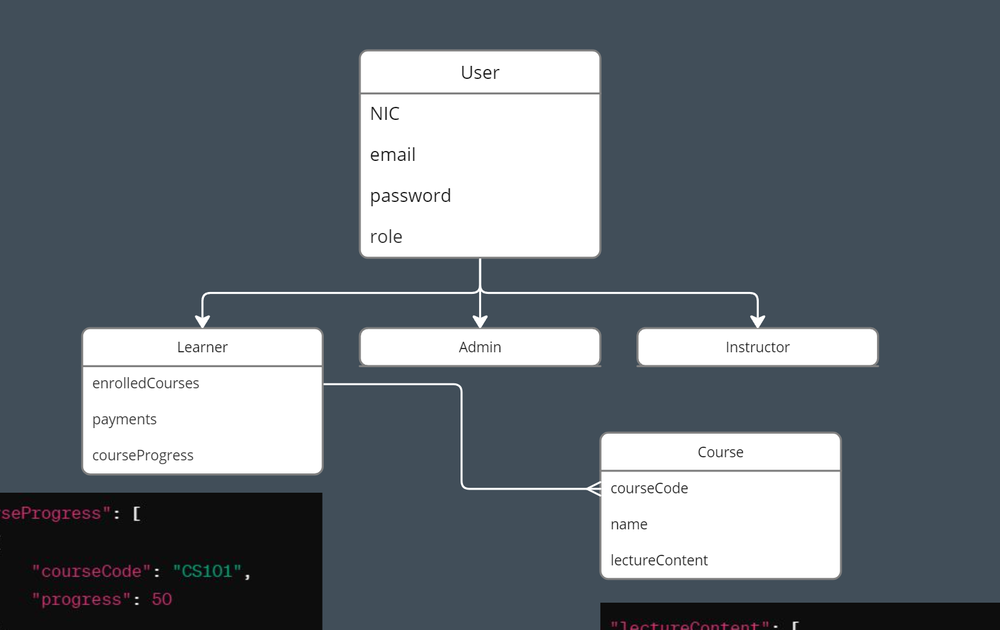

# Microservices Backend using Nodejs, Docker & Kubernetes

### Utilized Ports

```bash
    API_GATEWAY_PORT = 4000
    AUTH_PORT = 4001
    LEARNER_PORT = 4002
    COURSE_PORT = 4003
    PAYMENT_PORT = 4004
```

